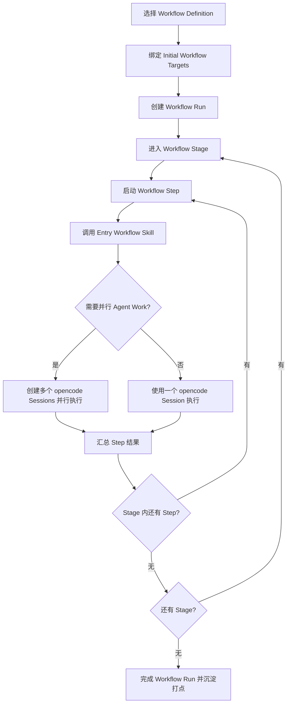
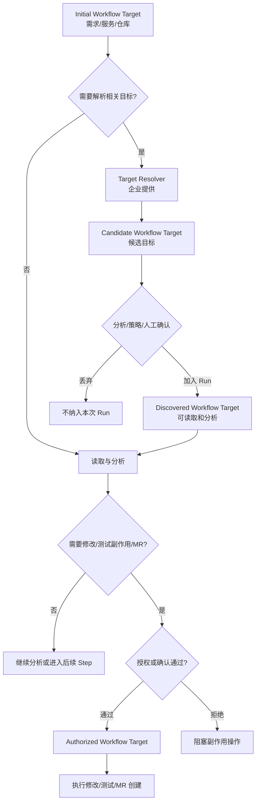

# Workflow Runtime 领域对齐稿

本文用于和领域专家对齐当前思路。它不是最终 PRD，也不是详细设计；重点是澄清领域边界、核心概念、已确认决策和仍需讨论的问题。

## 背景与目标

公司希望实现开发作业的全流程 Agent 自主执行，覆盖设计、编码、测试等阶段，并支持不同开发流程的自定义和过程数据打点。

当前共识是：本项目建设的是嵌入 opencode 的 **Workflow Runtime**，不是独立 BPM 平台或外部流程系统。Runtime 复用 opencode 的 Session、Agent、Skill、Tool、Permission 等能力，在其上增加开发作业流程编排能力。

## 整体逻辑

当前模型可以概括为：

```text
Workflow Definition 说明流程如何组织
Workflow Run 表示一次实际执行
Workflow Target 表示这次执行作用于什么对象
Workflow Skill 承载每个 Step 的业务执行
Workflow Runtime 负责推进、并行、状态、授权和打点
```

这套拆分的目的，是避免 Workflow Runtime 变成通用流程引擎或企业资产管理系统。流程骨架、执行对象、业务执行和安全授权分别由不同概念承载。

### 整体架构分层

```text
┌─────────────────────────────────────────────────────────────┐
│ 流程定义层                                                   │
│ Workflow Catalog / Repository Workflow Definition            │
│ 负责：沉淀可选择的 Workflow Definitions                      │
└───────────────────────────────┬─────────────────────────────┘
                                │ 选择一份流程定义
┌───────────────────────────────▼─────────────────────────────┐
│ Runtime 编排层                                                │
│ Workflow Runtime                                              │
│ 负责：创建 Run、推进 Stage/Step、并行 Agent、状态、授权、打点 │
└───────────────────────────────┬─────────────────────────────┘
                                │ 执行一次开发作业
┌───────────────────────────────▼─────────────────────────────┐
│ 运行实例层                                                   │
│ Workflow Run                                                  │
│ 包含：Workflow Targets、Stages、Steps、运行状态和审计记录     │
└───────────────┬───────────────────────────────┬─────────────┘
                │                               │
┌───────────────▼───────────────┐   ┌───────────▼─────────────┐
│ 业务执行层                    │   │ 目标解析层              │
│ Entry Workflow Skill           │   │ Target Resolver          │
│ Supporting Workflow Skills     │   │ Candidate Targets        │
│ opencode Sessions / Agents     │   │ Target Provenance        │
└───────────────────────────────┘   └─────────────────────────┘
```

| 层级 | 核心问题 | 不负责什么 |
| --- | --- | --- |
| 流程定义层 | 有哪些流程、流程骨架是什么、运行策略是什么 | 不写 Step 内部业务细节 |
| Runtime 编排层 | 如何推进 Run、如何创建 Session、如何并行、如何授权和打点 | 不维护企业资产目录，不决定业务分析结论 |
| 运行实例层 | 本次执行到哪一步、作用于哪些 Target、产生了哪些状态和审计记录 | 不定义通用流程模板 |
| 业务执行层 | 每个 Step 如何真正完成业务工作 | 不决定整个 Workflow 的结构 |
| 目标解析层 | 根据需求、服务、组件给出候选目标 | 不决定最终影响面，不自动授权修改 |

## 核心名词解释与例子

| 名词 | 概念 | 例子 | 边界说明 |
| --- | --- | --- | --- |
| Workflow Runtime | 嵌入 opencode 的流程运行时，负责执行开发作业流程 | 创建一次需求开发 Run，推进需求分析、设计、编码、测试、MR Review | 不是独立 BPM 平台，也不维护企业资产目录 |
| Workflow Definition | 流程骨架和运行策略 | “标准需求交付流程”“缺陷修复流程”“公共组件升级流程” | 不写 Step 内部业务逻辑 |
| Workflow Catalog | 多个 Workflow Definitions 的集中集合 | 企业级流程库、产品线流程库、团队流程库 | 解决多仓流程不适合放入单一业务仓的问题 |
| Workflow Catalog Repository | 第一版维护 Workflow Catalog 的 Git 仓库 | `workflow-catalog` 仓库，按企业/产品线/团队目录存放流程定义 | 不是业务代码仓，也不是第一版数据库管理后台 |
| Repository Workflow Definition | 放在单个代码仓中的特化流程定义 | 某个 SDK 仓库自定义 release 前检查流程 | 只适合仓库局部特化，不承载企业通用流程 |
| Workflow Selection Dimension | Definition 上用于判断是否适用当前上下文的维度 | 需求类型、产品线、风险等级、Target 类型、多仓/单仓 | 只用于推荐和筛选，不直接驱动执行 |
| Workflow Execution Dimension | Definition 上用于 Runtime 执行 Run 的维度 | Stage/Step、Entry Skill、重试、超时、并行策略、Target 影响级别 | 不用于表达业务执行细节 |
| Workflow Selector | 根据上下文推荐候选 Workflow Definitions 的能力 | 根据 `REQ-123` 推荐“标准需求交付流程”和“跨服务接口变更流程” | 只推荐 Definition，不创建 Run、不授权 Target、不选择 Step/Skill |
| Workflow Run | 某个流程的一次具体执行 | 针对 `REQ-123` 启动一次“标准需求交付流程” | 不是 opencode Session；一个 Run 可使用多个 Sessions |
| Workflow Run Record | Run 的持久运行记录 | 记录 Run 的 Targets、Stage/Step 状态、审计、结果 | 不是 Workflow Definition |
| Workflow Run State | Run、Stage、Step 当前执行状态 | running、waiting_for_input、waiting_for_authorization | 记录实际执行进展，不属于模板元数据 |
| Workflow Stage | Run 中的大阶段，用于管理和指标聚合 | 设计、编码、测试 | 第一版不支持 Stage 嵌套 Stage |
| Workflow Step | Stage 内的可执行单元 | 需求分析、系统设计、编码、LLT、静态检查、MR 创建 | Step 由 Skill 承载，不固定为 Agent/Manual/Tool 类型 |
| Workflow Skill | 业务提供的 Skill，承载一个 Step 的全部或部分执行 | 需求分析 Skill、系统设计 Skill、MR Review Skill | Skill 定义业务执行细节 |
| Entry Workflow Skill | Runtime 为某个 Step 启动的入口 Skill，负责该 Step 的结果 | 系统设计 Step 的入口 Skill 汇总多个设计 Agent 的结果 | 一个 Step 只有一个 Entry Skill |
| Entry Skill Result Contract | Entry Skill 向 Runtime 报告 Step 结果的最小契约 | 返回状态、摘要、产物引用、发现的 Targets、授权请求 | 不标准化设计文档、测试报告等业务产物内容 |
| Supporting Workflow Skill | Entry Skill 或其他 Supporting Skill 调用的辅助 Skill | 安全评审 Skill、性能分析 Skill、接口兼容性检查 Skill | 不直接代表独立 Workflow Step |
| Workflow Target | 本次 Run 作用的业务或代码对象 | 一个需求单、一个服务、一个组件、一个代码仓 | 不是 Workflow Definition 的生效范围 |
| Requirement Target | 需求、缺陷、问题单或变更主题 | `REQ-123`、`BUG-456`、支付链路超时治理 | 通常是 Run 的初始入口，不一定直接对应仓库 |
| Service/Component Target | 服务、微服务、平台组件或公共组件 | `payment-service`、`common-sdk`、`auth-gateway` | 可能解析到一个或多个 Repository Targets |
| Repository Target | 具体代码仓 | `payment-api.git`、`order-service.git`、`common-sdk.git` | 最接近编码、测试、MR 创建 |
| Initial Workflow Target | Run 启动时已知的 Target | 用户输入 `REQ-123` 或主仓库 `payment-api` | 不要求覆盖完整影响面 |
| Candidate Workflow Target | Target Resolver 返回的候选目标 | Resolver 认为 `order-service` 可能受 `REQ-123` 影响 | 还未加入 Run，不是最终影响面 |
| Discovered Workflow Target | 执行过程中确认加入 Run 的 Target | 需求分析后确认 `order-service` 需要纳入分析 | 可读取和分析，但不等于可修改 |
| Authorized Workflow Target | 已授权执行副作用动作的 Target | 架构师确认后允许修改 `payment-api` 并创建 MR | 修改、测试副作用、MR 创建前必须具备授权 |
| Target Resolver | 企业提供的目标解析能力 | 输入 `payment-service`，返回候选仓库 `payment-api`、`payment-worker` | 只给候选，不做最终影响面裁决 |
| Step-Internal Parallel Agent Work | 一个 Step 内部的多 Agent 并行 | 设计 Step 中架构、测试、安全 Agent 并行分析后汇总 | 第一版优先支持 |
| Workflow-Level Parallel Agent Work | Workflow 层多个 Step 或分支并行 | 前端和后端两个独立改动分支并行推进 | 保留领域模型，优先级低于 Step 内并行 |

## 已确认的核心决策

### 1. Runtime 边界

**Workflow Runtime** 嵌入 opencode 内部执行开发流程，不作为独立平台运行。它负责 Workflow Run 的生命周期、Stage/Step 推进、并行 Agent 工作、状态记录、失败处理、权限检查和数据打点。

### 2. Run 与 Session

一次开发作业执行称为 **Workflow Run**。它不是 opencode Session；一个 Workflow Run 可以使用一个或多个 opencode Sessions。Session 是运行上下文，Run 是业务流程执行实例。

### 3. 两层流程结构

第一版固定为两层结构：

- **Workflow Stage**：设计、编码、测试等大阶段，用于管理、展示和指标聚合。
- **Workflow Step**：需求分析、系统设计、编码、LLT、静态检查、MR 创建等可执行单元。

第一版不支持任意嵌套 Stage/Step。复杂度优先放在 Step 依赖、运行策略和 Skill 内部编排上。

### 4. Step 由 Skill 承载

Workflow Step 不固定分为 Agent Step、Manual Step、Tool Step。每个 Step 由业务提供的 **Workflow Skill** 承载。

一个 Step 可以涉及多个 Skill，但必须有一个 **Entry Workflow Skill** 作为入口和结果责任方。其他被调用的 Skill 是 **Supporting Workflow Skill**。Step 是否存在交互流程，由 Skill 自己定义。

### 5. Runtime 与 Skill 职责

**Workflow Definition** 只定义流程骨架和运行策略，例如 Stage、Step、Entry Skill、顺序、并行、重试、超时、打点标签等。

Skill 定义业务执行细节，例如需求分析如何提问、设计如何产出、多个 Agent 结果如何汇总、Step 如何判定业务成功。

Entry Workflow Skill 完成 Step 后，需要通过 **Entry Skill Result Contract** 向 Runtime 返回最小结果。第一阶段只标准化 Runtime 必须理解的字段，不标准化业务产物内容。

```yaml
status: succeeded | failed | waiting_for_input
summary: 简短结果说明
outputs:
  - type: document | patch | report | link | data
    name: 产物名称
    ref: 产物引用
discoveredTargets:
  - type: repository
    id: payment-api
    provenance: impact-analysis
authorizationRequests:
  - target: payment-api
    effect: modify
    reason: 需要修改支付超时处理逻辑
```

Runtime 只依赖这个契约推进状态、记录审计、追加 Discovered Targets、处理授权请求和保存产物引用。设计文档结构、测试报告结构、MR Review 细则等仍由业务 Skill 自己定义。

### 6. 并行 Agent 工作

支持两类并行：

- **Step-Internal Parallel Agent Work**：一个 Step 内多个 Agent 并行，例如多视角需求分析、设计评审、MR Review。
- **Workflow-Level Parallel Agent Work**：多个 Step 或流程分支并行。

第一版优先支持 Step 内并行 Agent Work，同时保留 Workflow 级并行的领域模型。

第一阶段执行顺序约束：

- Stages 按 Workflow Definition 中的顺序执行。
- Stage 内 Steps 按定义顺序执行。
- Step 内可以由 Entry Workflow Skill 触发 Step-Internal Parallel Agent Work。
- 第一阶段暂不支持 Step DAG、条件分支、并行 Step、跳过 Step。
- Workflow-Level Parallel Agent Work 保留为后续扩展。

### Run 执行流程图



## Workflow Definition 与 Target

### Definition Scope 与 Target 拆分

流程定义的维护范围和一次执行的作用对象必须拆开：

- **Workflow Definition Scope**：流程定义由谁维护、在哪里生效，例如企业级、团队级、产品线级、仓库级。
- **Workflow Target**：一次 Workflow Run 实际作用的对象。

这解决企业多仓开发场景下“流程不适合放在某一个业务仓里”的问题。

### Target 类型

第一版 Workflow Target 支持三类：

- **Requirement Target**：需求单、缺陷单、变更主题、工作项。
- **Service/Component Target**：服务、微服务、公共组件。
- **Repository Target**：具体代码仓。

Target 不要求在 Run 启动时全部明确。Run 可以从 **Initial Workflow Target** 开始，并在执行过程中加入 **Discovered Workflow Target**。

## Workflow Run 状态承载

状态模型属于 **Workflow Run Record**，不属于 Workflow Definition。Definition 描述“应该怎么跑”，Run Record 记录“实际跑到哪里、为什么停住、结果如何”。

```text
Workflow Run Record
  ├─ Run state
  ├─ Stage states
  ├─ Step states
  ├─ Workflow Targets
  ├─ authorization decisions
  ├─ audit events
  └─ outputs / results
```

状态主要由 Workflow Runtime 写入。Entry Workflow Skill 可以报告结果、等待原因或错误，但不应绕过 Runtime 直接修改状态。

主要消费者包括：

- Runtime：决定下一步是否可执行、是否推进 Stage/Step、是否阻塞。
- 用户界面 / CLI / TUI：展示当前进度、阻塞原因和待用户处理事项。
- 数据打点 / 审计：统计耗时、失败率、授权次数、人工介入次数。
- 恢复机制：中断后识别 Run 停在哪里。
- 外部系统：查询或订阅执行进度。

第一阶段 Workflow Run State 使用一套简单枚举，Run / Stage / Step 共用：

| 状态 | 含义 |
| --- | --- |
| `pending` | 已创建，等待开始 |
| `running` | 执行中 |
| `waiting_for_input` | 等待用户补充信息或回答 Skill 交互问题 |
| `waiting_for_authorization` | 等待用户确认 Target 副作用授权 |
| `succeeded` | 成功完成 |
| `failed` | 失败结束 |
| `cancelled` | 用户取消 |

第一阶段暂不引入 `paused`、`skipped`、`retrying`、`partially_succeeded` 等细状态。

第一阶段状态汇总采用派生规则，不手工单独设置父级状态：

- Step 状态由 Runtime 直接写入。
- Stage 状态由其 Steps 派生。
- Run 状态由其 Stages 派生。
- 任一子项 `running`，父级为 `running`。
- 任一子项 `waiting_for_input`，父级为 `waiting_for_input`。
- 任一子项 `waiting_for_authorization`，父级为 `waiting_for_authorization`。
- 所有子项 `succeeded`，父级为 `succeeded`。
- 任一子项 `failed`，父级为 `failed`。
- 任一子项 `cancelled`，父级为 `cancelled`。
- 第一阶段不支持部分成功；一个 Step 失败会导致当前 Stage/Run 失败，除非后续引入可选 Step 或失败策略。

### Target 发现与授权

Target 的发现和副作用授权分离：

- 被发现的 Target 可以用于读取和分析。
- 进入代码修改、有副作用测试、MR 创建等动作前，必须成为 **Authorized Workflow Target**。
- 每个 Target 都需要记录 **Workflow Target Provenance**，说明来源是用户输入、Skill 发现、策略授权还是外部系统同步。

### Target 发现与授权流程图



## Target Resolver

**Target Resolver** 是企业提供的目标解析能力，用于把 Requirement Target 或 Service/Component Target 解析成候选相关目标，尤其是候选 Repository Target。

Target Resolver 处于支撑能力层，不属于 Stage/Step 层级。Workflow Runtime 或 Entry Workflow Skill 可以调用它。

当前边界：

- Target Resolver 由企业侧提供，不由 Workflow Runtime 内建企业资产目录。
- 由于企业资产积累不完善、产品架构划分不一致，第一版可以先提供 provisional resolver。
- Resolver 输出的是 **Candidate Workflow Target**，不是最终影响面。
- Candidate Target 需要经过分析、策略或人工确认，才会成为 Discovered Workflow Target。

## Workflow Catalog 待讨论点

关于 Workflow Definition 的来源，当前倾向是 **Workflow Catalog 为主，Repository Workflow Definition 为辅**。第一版 Workflow Catalog 采用 **Git-backed Workflow Catalog Repository** 维护，而不是直接建设数据库和管理 UI。

Catalog Repository 的第一版维护方式：

- 使用独立流程库仓库，例如 `workflow-catalog`，不依附单一业务代码仓。
- 每个 Workflow Definition 使用声明式文件维护，例如 YAML 或 JSON。
- 第一阶段先从一个简单目录读取 Workflow Definitions，不设计复杂目录治理。
- 通过 MR / Code Review 管理新增、修改和废弃。
- 通过版本号、状态字段、owner 字段管理生命周期。
- Runtime / Selector 从 Catalog Repository 加载可用 Workflow Definitions。

### Definition 维度与流程选用

已确认：**Workflow Selector 选择的是 Workflow Definition**。它根据当前输入上下文推荐一个或多个候选 Workflow Definitions，并给出推荐理由；它不创建 Workflow Run，不授权 Workflow Target，不选择某个 Step 或 Skill，也不决定最终影响面。

Workflow Definition 的维度拆成两类：

| 类型 | 用途 | 典型维度 |
| --- | --- | --- |
| Workflow Selection Dimension | 供 Workflow Selector 判断“这个流程适不适合当前需求” | 适用 Target 类型、需求/问题类型、组织范围、产品/领域标签、仓库拓扑、风险等级、生命周期覆盖、能力要求 |
| Workflow Execution Dimension | 供 Workflow Runtime 真正执行流程 | Stage/Step 结构、Entry Skill、Step 依赖/顺序、并行策略、重试/超时、Target 影响级别、人工确认点、输出与打点 |

Selector 的推荐过程可以先按 Selection Dimensions 做硬过滤，再按匹配度排序，最后输出候选 Workflow Definitions、推荐理由、不适用原因和缺失信息。最终选择仍需要用户、上层系统或组织策略显式确认。

领域专家需要重点讨论两个问题：

1. **流程选用**：如何对 Workflow Definitions 分类？如何根据需求单、问题单、服务、组件或仓库推荐或确认使用哪个流程？
2. **Catalog 治理**：当流程数量变多后，如何定义目录规范、版本策略、审核规则、发布节奏、废弃机制、owner 责任和访问权限？

### 第一阶段遗留问题

- Workflow Catalog Repository 的目录组织暂不设计复杂层级；第一阶段先从一个简单目录读取 Workflow Definitions。
- 后续再讨论是否按企业、产品线、团队、仓库或流程类型组织目录。
- 后续再定义 Catalog 的状态流转、版本策略、owner 机制和发布节奏。

### 第一阶段 Definition 最小字段集

第一阶段 Workflow Definition 只保留支撑 Selector 推荐和 Runtime 执行的最小闭环字段：

```yaml
id: standard-requirement-delivery
name: 标准需求交付流程
description: 覆盖需求分析、设计、编码、测试、MR 创建的标准流程
version: 0.1.0
status: active
owner: platform-workflow-team

selection:
  targetTypes: [requirement, repository, service-component]
  workTypes: [feature, defect-fix]
  scopes: [enterprise]
  riskLevels: [low, medium]
  tags: [standard-delivery]

execution:
  stages:
    - id: design
      name: 设计
      steps:
        - id: requirement-analysis
          name: 需求分析
          entrySkill: requirement-analysis
          targetEffect: analyze
        - id: system-design
          name: 系统设计
          entrySkill: system-design
          targetEffect: analyze
    - id: coding
      name: 编码
      steps:
        - id: implementation
          name: 编码实现
          entrySkill: implementation
          targetEffect: modify
    - id: test
      name: 测试
      steps:
        - id: static-check
          name: 静态检查
          entrySkill: static-check
          targetEffect: analyze
```

第一阶段暂不引入复杂目录组织、多版本继承、Definition 继承/组合、可视化编排元数据、复杂条件表达式、复杂权限策略 DSL、Catalog 发布流状态机。

### 第一阶段 targetEffect 枚举

`targetEffect` 表达某个 Workflow Step 对相关 Workflow Target 的影响级别。第一阶段采用 4 个枚举：

| 枚举 | Step 对 Target 的影响 | 例子 | 是否需要 Authorized Workflow Target |
| --- | --- | --- | --- |
| `read` | 只读取目标信息 | 读取需求单、仓库文件、服务元数据 | 否 |
| `analyze` | 读取并产出分析结论，但不改变目标 | 需求分析、影响面分析、系统设计、静态检查结果分析 | 否 |
| `modify` | 改变代码、本地工作区或可提交内容 | 编码实现、修复测试、改配置 | 是 |
| `submit` | 对外提交或触发外部可见副作用 | 创建 MR、提交评审、触发正式流水线、更新问题单状态 | 是 |

`targetEffect` 不表达业务动作类型。测试、评审、审批等业务动作由 Step/Skill 表达；它们对应哪种 targetEffect，取决于是否只分析、是否修改目标、是否触发外部可见副作用。

第一阶段每个 Workflow Step 只声明一个统一的 `targetEffect`。暂不支持按 Target 类型或 Target 集合声明不同 effect，例如不支持 `requirement: analyze`、`repository: modify` 这类矩阵配置。这样可以保持 Runtime 执行前检查、审计和打点规则简单稳定。

Runtime 执行前检查规则：

- `read` / `analyze` 可以作用于 Discovered Workflow Target。
- `modify` / `submit` 必须要求相关 Target 已经是 Authorized Workflow Target。
- 如果 Step 需要 `modify` / `submit`，但相关 Target 未授权，Runtime 阻塞该 Step，并生成确认请求。
- 确认请求需要说明 Step、Target、targetEffect、Target Provenance 和授权原因。
- 第一阶段确认请求由当前用户显式处理，并将确认结果记录到 Workflow Run 审计中。
- 第一阶段如果授权被拒绝，可先将 Step 标记为失败或等待人工处理。
- 组织策略、仓库 owner、架构师审批、自动授权规则作为后续扩展。

## 已记录 ADR

- `0001-use-two-level-workflow-structure.md`：第一版使用 Stage/Step 两层流程结构。
- `0002-use-entry-skills-for-step-ownership.md`：每个 Step 由 Entry Workflow Skill 负责结果归属。
- `0003-prioritize-step-internal-parallel-agent-work.md`：第一版优先支持 Step 内并行 Agent 工作。
- `0004-keep-workflow-definitions-structural.md`：Workflow Definition 只定义流程结构和运行策略。
- `0005-allow-workflow-targets-to-be-discovered-during-runs.md`：Workflow Target 可在 Run 中动态发现。
- `0006-separate-target-discovery-from-side-effect-authorization.md`：目标发现与副作用授权分离。
- `0007-use-enterprise-provided-target-resolution.md`：Target Resolver 由企业提供，Runtime 不内建资产目录。
- `0008-keep-target-resolution-advisory.md`：Target Resolver 只输出候选目标，不做最终影响面裁决。
- `0009-select-workflow-definitions-by-selection-dimensions.md`：Workflow Selector 只基于选择维度推荐 Workflow Definition。
- `0010-use-git-backed-workflow-catalog-repository.md`：第一版使用 Git-backed Workflow Catalog Repository 维护流程库。

## 需要领域专家确认的问题

- Workflow Catalog 应该按企业、团队、产品线还是流程类型组织？
- 如何定义 Workflow Selection Dimensions 的标准枚举，例如需求类型、风险等级、多仓/单仓、是否涉及 MR、是否涉及测试和发布？
- Workflow Selector 推荐结果由谁最终确认：用户、上层系统、组织策略，还是分场景组合？
- Workflow Catalog Repository 后续如何定义目录规范、状态流转、版本策略和 owner 机制？
- Target Resolver 第一版的数据来源是什么？配置文件、服务目录、代码平台、CMDB、人工维护表，还是多源组合？
- Service/Component Target 到 Repository Target 的映射，哪些产品线可以先试点？
- 后续 Authorized Workflow Target 的组织级授权策略如何扩展：仓库 owner、架构师审批、企业统一策略，还是组合？
- 数据打点需要覆盖哪些粒度：Run、Stage、Step、Skill、Agent、Target、授权事件、失败原因？

## 当前一句话结论

当前方案的核心是：用 Workflow Definition 描述开发流程骨架，用 Workflow Run 执行一次开发作业，用 Workflow Target 表达作用范围，用 Workflow Skill 承载业务执行细节，由 Workflow Runtime 负责流程推进、并行协作、状态打点和安全授权。
